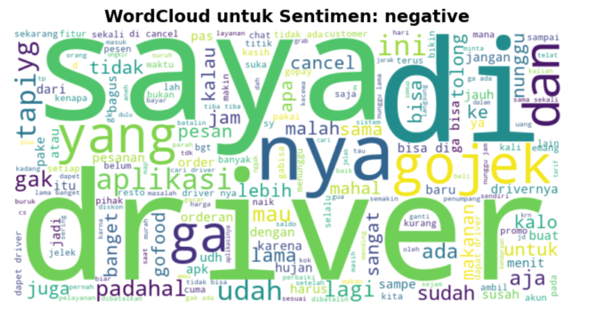
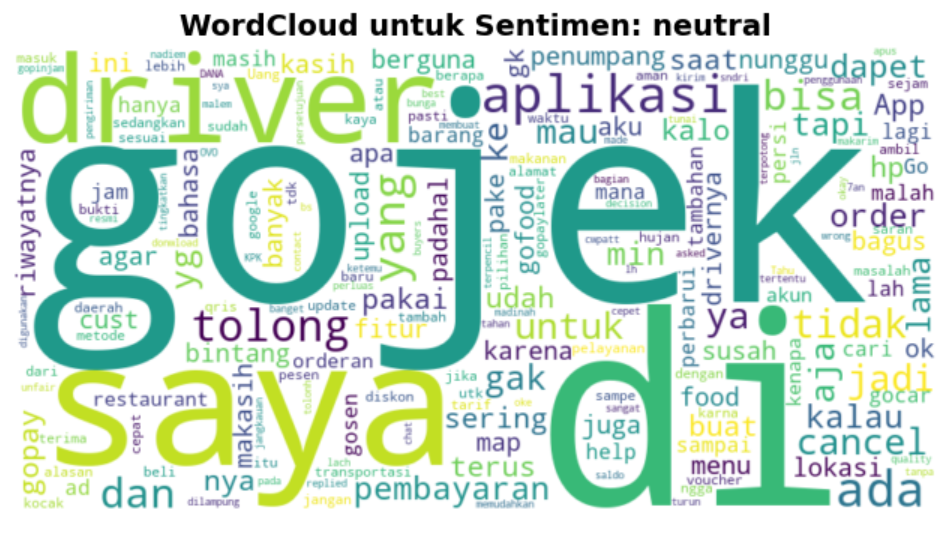
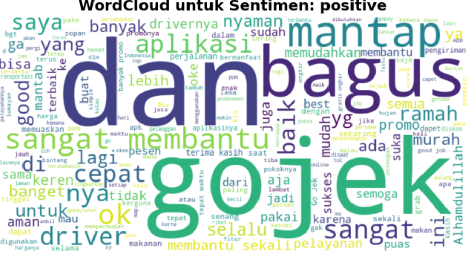

# Gojek User Sentiment Analysis 🛵

## 📄 Project Overview
This project analyzes user reviews of the **Gojek** application from the Google Play Store using **Python** and **Natural Language Processing (NLP)**.  
The goal is to understand customer satisfaction by classifying reviews into positive, neutral, and negative sentiments, then visualizing key insights to support service improvement decisions.

---

## 🎯 Objectives
- Identify user perceptions of Gojek’s services.
- Determine the proportion of positive, neutral, and negative reviews.
- Discover the most frequent words in positive and negative feedback.

---

## 🧰 Tools & Libraries
- **Python**
- **Libraries:** google-play-scraper, pandas, re, Sastrawi, matplotlib, seaborn, wordcloud, transformers
- **Environment:** Jupyter Notebook

---
## ⚙️ Project Workflow
### 1. Data Collection
User reviews were scraped from the **Gojek Google Play Store page** using `requests` and `BeautifulSoup`.  
The collected data was stored in a structured CSV format for further analysis.

### 2. Data Cleaning & Preprocessing
- Removal of duplicates and null values.  
- Text normalization: lowercasing, punctuation removal, and tokenization.  
- Filtering of short or irrelevant reviews.

### 3. Sentiment Analysis
Using a **pre-trained NLP sentiment classifier**, each review was labeled as:
- **Positive**
- **Neutral**
- **Negative**

### 4. Data Visualization
Visual exploration of the sentiment distribution and most frequent keywords through:
- Pie charts for sentiment proportions  
- Word clouds for dominant words in each sentiment group  

---

## 📈 Visualizations
### Sentiment Distribution


### Negative Review Word Cloud


### Negative Review Word Cloud


### Negative Review Word Cloud


---

## 🧩 How to Run the Project
1. Clone this repository:
   ```bash
   git clone https://github.com/<your-username>/gojek-sentiment-analysis.git
   ```
2. Navigate to the project folder:
   ```bash
   cd gojek-sentiment-analysis
   ```
4. Install the required libraries:
   ```bash
   pip install -r requirements.txt
   ```
6. Open and run the Jupyter Notebook:
   ```bash
   jupyter notebook notebooks/gojek_sentiment_analysis.ipynb
   ```
---

## 📁 Project Structure

python-sentiment-analysis-gojekApp/

│

├── data/

│ ├── gojek_reviews.csv # Scraped review dataset (raw)

│ └── gojek_cleaned.csv # Scraped review dataset (cleaned)

│

├── gojek_sentiment_analysis.ipynb # Main analysis notebook

│

├── output/

│ ├── sentiment_pie_chart.png # Visualization results

│ ├── wordcloud_negative.png

│ ├── wordcloud_neutral.png

│ ├── wordcloud_positive.png

│ ├── insight_summary.pdf # Final interpretation report

└── 

---

